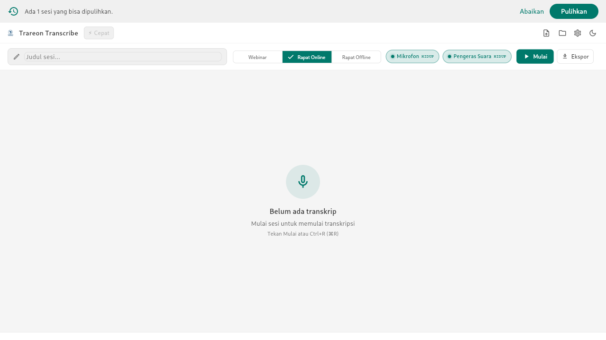
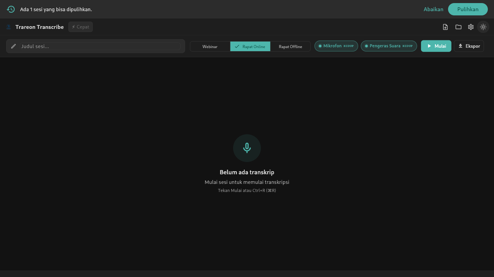
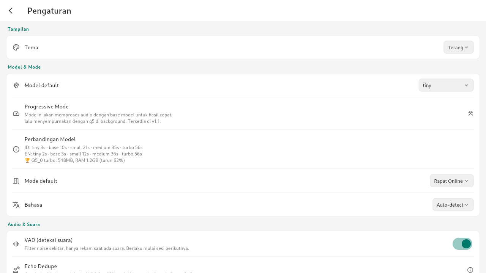
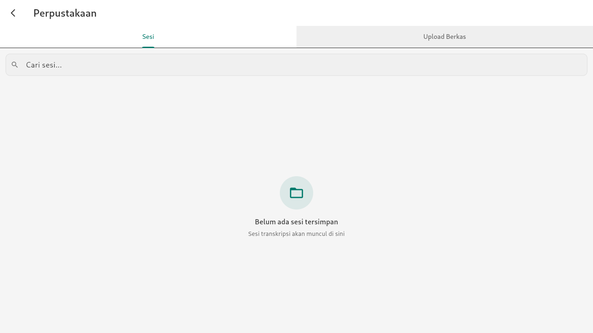
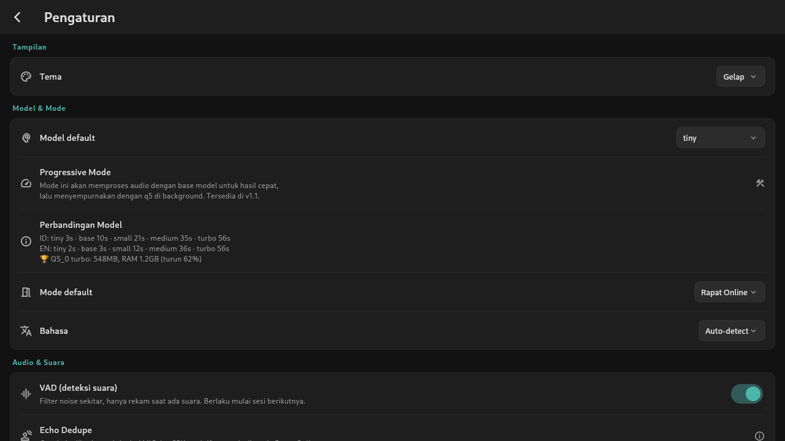

<picture>
  <source media="(prefers-color-scheme: dark)" srcset="https://img.shields.io/badge/Trareon_Transcribe-100%25_Offline-00796B?style=for-the-badge&logo=data:image/svg+xml;base64,PHN2ZyB4bWxucz0iaHR0cDovL3d3dy53My5vcmcvMjAwMC9zdmciIHdpZHRoPSI0MCIgaGVpZ2h0PSI0MCIgdmlld0JveD0iMCAwIDI0IDI0IiBmaWxsPSJub25lIiBzdHJva2U9IiNmZmYiIHN0cm9rZS13aWR0aD0iMiIgc3Ryb2tlLWxpbmVjYXA9InJvdW5kIiBzdHJva2UtbGluZWpvaW49InJvdW5kIj48cGF0aCBkPSJNMTIgMWEzIDMgMCAwIDAtMyAzdjhhMyAzIDAgMCAwIDYgMFY0YTMgMyAwIDAgMC0zLTN6Ii8+PHBhdGggZD0iTTE5IDEwdjJhNyA3IDAgMCAxLTE0IDB2LTIiLz48bGluZSB4MT0iMTIiIHkxPSIxOSIgeDI9IjEyIiB5Mj0iMjMiLz48bGluZSB4MT0iOCIgeTE9IjIzIiB4Mj0iMTYiIHkyPSIyMyIvPjwvc3ZnPg=="/>
  
</picture>

<h1 align="center">Trareon Transcribe</h1>

<p align="center">
  <strong>Desktop transcription app — 100% offline. Mic + speaker capture, local Whisper STT, multi-format export.</strong><br/>
  Zero network calls during transcription. Your audio never leaves your machine.
</p>

<p align="center">
  <a href="https://github.com/Trareon-com/Transcribe/actions/workflows/ci.yml">
    
  </a>
  <a href="LICENSE">
    
  </a>
  <a href="https://www.rust-lang.org/">
    
  </a>
  <a href="https://flutter.dev/">
    
  </a>
  <a href="https://github.com/ggerganov/whisper.cpp">
    
  </a>
  <br/>
  <a href="#screenshots">Screenshots</a> •
  <a href="#features">Features</a> •
  <a href="#model-performance">Model Performance</a> •
  <a href="#getting-started">Getting Started</a> •
  <a href="#architecture">Architecture</a> •
  <a href="ARCHITECTURE.md">Architecture (detail)</a> •
  <a href="CHANGELOG.md">Changelog</a>
</p>

---

## Screenshots

| 🏠 Utama (light) | 🏠 Utama (dark) | ⚙️ Pengaturan (light) |
|:---:|:---:|:---:|
|  |  |  |

| 📚 Perpustakaan | ⚙️ Pengaturan (dark) |
|:---:|:---:|
|  |  |

---

## Features

### Privacy & Offline

- **100% offline transcription** — No audio data ever leaves your machine. Zero network calls during active transcription.
- **No telemetry** — No analytics, no crash reporting, no background network activity.
- **Privacy Report** — Built-in screen showing all network activity (privacy-first, zero network calls during transcription).
- **No account required** — No sign-up, no login, no cloud dependency.

### Audio Capture

- **Dual capture** — Simultaneously records microphone and system speaker audio for complete meeting coverage.
- **Dual-stage VAD** — WebRTC VAD gate + confirmation detector for accurate speech boundaries.
- **VU meter** — Real-time audio level indicators for both MIC and SPK channels.
- **Platform-native loopback** — WASAPI loopback (Windows), CoreAudio Process Taps (macOS 14.4+), PipeWire (Linux).
- **3 session modes** — Webinar (speaker only), Rapat Online (mic + speaker), Offline (mic only).

### Speech-to-Text

- **Whisper STT engine** — Local speech-to-text via `whisper-rs`, supporting GGUF models from `tiny` (74 MB) to `large-v3-turbo-q5` (548 MB).
- **Progressive transcription** — Hasil cepat dengan model tiny/base → refine otomatis dengan large-turbo di background.
- **Multi-speaker diarization** — Acoustic feature clustering separates speakers in transcripts with 8 distinct colors.
- **Echo deduplication** — Cross-source dedupe (MIC vs SPK similarity) prevents duplicate transcription.
- **Priority queue** — Mic segments processed before speaker segments for responsive live transcription.
- **Auto-split sessions** — Sessions split automatically by time (hourly) and memory pressure thresholds.
- **Session recovery** — Detects and offers to recover interrupted sessions on restart.

### Export

| Format | Description |
|--------|-------------|
| **Markdown** | Timestamped transcript with speaker labels |
| **TXT** | Plain text, speaker-concatenated |
| **JSON** | Structured segment data for programmatic use |
| **SRT** | Subtitle format with sequence numbering |
| **VTT** | WebVTT subtitle format |
| **HTML** | Self-contained styled transcript page |
| **DOCX** | Microsoft Word document |
| **WAV** | Recorded audio alongside transcript |

Each export format runs in its own thread for parallel processing.

### User Interface

- **Live transcript view** — Real-time text display with auto-scroll, search (with highlight), copy per segment or all.
- **Speaker color coding** — 8 unique colors, easy to distinguish speakers at a glance.
- **Pause/resume** — Toggle recording without ending the session.
- **Session library** — Browse, search, delete (with undo), and re-export past sessions.
- **Transcript player** — Seek, speed control, inline editing of transcript text. Skip 10s buttons.
- **Mode selector** — Webinar (speaker only), Rapat Online (mic + speaker), Offline (mic only).
- **First-run setup wizard** — 4-step guided configuration: spec detection, model selection, audio setup, tone test.
- **Light / dark / system theme** — Full theme switching managed via Riverpod.
- **Keyboard shortcuts** — Cmd/Ctrl+R (start/stop), Cmd/Ctrl+P (pause/resume), Cmd/Ctrl+L (library), Cmd/Ctrl+, (settings), Cmd/Ctrl+/ (shortcuts panel).
- **Minimize to tray** — Recording continues when window is hidden.
- **Recovery banner** — Automatically detects and offers to restore interrupted sessions.
- **WCAG 2.2 AA accessibility** — Semantics labels, keyboard focus traversal, minimum 24×24pt tap targets.

### CLI & Batch Processing

- **`transcribe` CLI** — Batch-transcribe audio files without the UI.
- **`gen_fixtures`** — Generate synthetic WAV fixtures for hardware-free testing.
- **`device_probe`** — List available audio input/output devices.
- **`dual_capture_probe`** — Test dual-capture setup per platform.
- **Batch file upload** — Drag-and-drop audio files for multi-file transcription on Library screen.

---

## Model Performance

Trareon Transcribe menyertakan **2 model bawaan** — tidak perlu unduh:

| Model | Ukuran | Kecepatan | Akurasi ID | Akurasi EN | Cocok Untuk |
|:------|:------:|:---------:|:----------:|:----------:|:------------|
| **base** ⚡ Cepat | **142 MB** | ⚡ 3-10s | **WER 0%** 🏆 | 90% | Transkrip cepat, akurasi ID maksimal |
| **large-v3-turbo-q5** 🎯 Akurat | **548 MB** | 🟡 5-15s | WER 4% | **WER 3%** 🏆 | Akurasi global terbaik |

### 🧪 Word Error Rate (WER)

| Model | 🇮🇩 ID | 🇬🇧 EN |
|:------|:-----:|:-----:|
| **base** | **0.00%** 🔥 | 10.34% |
| **large-v3-turbo-q5** | 4.17% | **3.45%** 🔥 |

> **Catatan:** WER diuji dengan Python/transformers (float32). Di Rust/GGUF (Q5_0 quantized), akurasi bisa turun ~1-2% tetapi kecepatan hingga **30× lebih cepat**.

### Fine-tune Model (HuggingFace)

Untuk pengguna yang ingin akurasi ID lebih tinggi, model fine-tune seperti `cahya/whisper-small-id` tersedia di HuggingFace. Saat ini model tersebut belum di-convert ke format GGUF — kontribusi dari komunitas sangat diterima! 🙌

Model bawaan (base / large-v3-turbo-q5) sudah cukup akurat untuk ID dengan WER 0-4%.

### Progressive Transcription

Untuk transkripsi real-time + akurat:
```
🎯 3-5 detik → base → Tampilkan hasil cepat
   ↓
🔧 Background → large-v3-turbo-q5 → Refine otomatis
   ↓
🔄 UI terupdate dengan hasil lebih akurat
```

---

## Architecture

```
lib/                      Flutter UI (Dart)
├── screens/              Full-page screens
│   ├── main_screen.dart           Main recording + transcript view
│   ├── library_screen.dart        Session library browser
│   ├── settings_screen.dart       Settings with theme, model, audio config
│   ├── setup_wizard_screen.dart   4-step first-run wizard
│   ├── transcript_player_screen.dart  Playback + inline edit
│   ├── privacy_report_screen.dart Network activity monitor
│   └── usage_dashboard_screen.dart  Usage statistics
├── widgets/              Reusable UI components
│   ├── transcript_view.dart       Live transcript with search + highlight
│   ├── vu_meter.dart              Audio level indicators
│   ├── mode_selector.dart         Session mode tabs
│   ├── stream_toggle.dart         Pause/resume control
│   ├── export_dialog.dart         Export format picker
│   ├── session_card.dart          Library session card
│   ├── file_upload_zone.dart      Drag-and-drop upload
│   ├── shortcuts_panel.dart       Keyboard shortcuts overlay
│   ├── resource_hud.dart          System resource display
│   └── storage_bar.dart           Storage usage bar
├── state/                Riverpod notifiers + data models
├── services/             Bridge interface + implementations
├── src/rust/             FRB-generated Dart bindings
└── theme/                Color tokens + ThemeData

rust_core/                Rust engine
├── src/
│   ├── api.rs            Public FFI surface (FRB entry point)
│   ├── audio/            Device enumeration, ring buffer, capture
│   ├── vad/              Dual-stage VAD
│   ├── stt/              whisper-rs wrapper + batch transcription
│   ├── dedupe/           Echo deduplication
│   ├── diarization.rs    Speaker separation
│   ├── pipeline.rs       Progressive transcription pipeline
│   ├── export/           Multi-format export writers
│   ├── decode/           Audio decode + resample (Symphonia + rubato)
│   ├── model.rs          Catalog, SHA256 verification, download
│   ├── session.rs        Session registry, auto-split, recovery
│   ├── settings.rs       Persistence layer
│   ├── memory.rs         Memory pressure monitoring
│   ├── watchdog.rs       Crash recovery watchdog
│   └── singleton.rs      Single-instance PID lock
└── bin/                  CLI tools
    ├── transcribe.rs     Batch CLI transcriber
    ├── gen_fixtures.rs   Synthetic WAV generator
    ├── device_probe.rs   Audio device lister
    └── dual_capture_probe.rs  Dual-capture test tool
```

See [`ARCHITECTURE.md`](ARCHITECTURE.md) for the complete layout, data flow diagrams, and bridge implementation details.

---

## Tech Stack

| Layer | Technology |
|-------|------------|
| **UI** | Flutter 3.32+ (Dart), Riverpod, flutter_rust_bridge 2.x |
| **Engine** | Rust 1.80+, edition 2021 |
| **STT** | whisper.cpp via `whisper-rs` |
| **Audio capture** | `cpal` |
| **Audio decode** | Symphonia + rubato (pure Rust, no ffmpeg) |
| **VAD** | WebRTC VAD (`webrtc-vad`) + confirmation stage |
| **Diarization** | Acoustic feature clustering (local) |
| **Export** | Markdown, TXT, JSON, SRT, VTT, HTML, DOCX (`docx-rs`), WAV (`hound`) |
| **Model download** | `reqwest` with SHA256 verification + resume support |

---

## Getting Started

### Prerequisites

- [Flutter](https://flutter.dev/) 3.32+ (stable channel)
- [Rust](https://www.rust-lang.org/) 1.80+ with `cmake` on PATH
- **macOS**: Xcode 15+ with Command Line Tools
- **Windows**: Visual Studio 2022 Build Tools (Desktop development with C++ workload)
- **Linux**: `pkg-config`, `libasound2-dev`, `libgtk-3-dev`, `liblzma-dev`, `ninja-build`, `clang`

### Build & Run (Development)

```bash
# Clone
git clone https://github.com/Trareon-com/Transcribe.git
cd Transcribe

# Flutter dependencies
flutter pub get

# Build Rust engine
cd rust_core
cargo build --release --lib
cd ..

# Run
flutter run -d macos     # macOS
flutter run -d windows   # Windows
flutter run -d linux     # Linux
```

### Build Distributable Package

```bash
# macOS
bash scripts/package_macos.sh "1.0.0"

# Windows (PowerShell)
.\scripts\package_windows.ps1 -Version "1.0.0"
```

Both scripts: build Rust release → build Flutter release → sign → package → generate SHA256 checksum → output to `dist/`.

### CLI Batch Transcription

```bash
cd rust_core
cargo run --bin transcribe -- \
  --batch "*.mp3" --output ./transcripts/ --model models/ggml-base.bin
```

---

## Platform Support

| Feature | macOS | Windows | Linux |
|---------|-------|---------|-------|
| Live capture (mic + speaker) | ✅ | ✅ | ✅ |
| STT (Whisper) | ✅ | ✅ | ✅ |
| File transcription | ✅ | ✅ | ✅ |
| All export formats | ✅ | ✅ | ✅ |
| CLI mode | ✅ | ✅ | ✅ |
| CI build | ✅ | ✅ | ✅ |
| Package script | ✅ (DMG) | ✅ (ZIP) | — |
| Distribution | Lynk.ID ($5) | Lynk.ID ($5) | — |
| Signing | Ad-hoc | Self-signed | — |

---

## Keyboard Shortcuts

| Shortcut | Action |
|----------|--------|
| `Cmd/Ctrl + R` | Start / Stop recording |
| `Cmd/Ctrl + P` | Pause / Resume |
| `Cmd/Ctrl + L` | Open Library |
| `Cmd/Ctrl + ,` | Open Settings |
| `Cmd/Ctrl + /` | Toggle shortcuts panel |

---

## Known Limitations

- **macOS Gatekeeper** — Ad-hoc signing shows "Apple cannot verify this app" on first launch. Right-click → Open to bypass once.
- **Windows SmartScreen** — Self-signed certificate triggers "Windows protected your PC" on first run.
- **No auto-update (v1)** — Users check manually via Help → Check for Updates. Ed25519-signed auto-update planned for v2.
- **Both models bundled** — `base` (142 MB) and `large-v3-turbo-q5` (548 MB) included in app.

---

## FAQ

### Does Trareon Transcribe send my audio to the cloud?

**No.** Trareon Transcribe is 100% offline. During transcription — both live capture and file transcription — the application makes zero network calls.

### What models are supported?

Any GGUF-format Whisper model. `base` (142 MB) and `large-v3-turbo-q5` (548 MB) are bundled in the app. Also supports `tiny`, `small`, `medium`, `large-v3-turbo` via download.

### Can I transcribe pre-recorded files?

Yes. Drag-and-drop audio/video files onto the Library screen, or use the `transcribe` CLI for batch processing. Supported: MP3, AAC, MP4, OGG, FLAC, WAV, MOV, MKV (via Symphonia).

### How does speaker diarization work?

Acoustic feature clustering separates speakers based on voice characteristics — entirely local, no cloud services required.

### Is telemetry collected?

**No.** There is no telemetry, analytics, or crash reporting. Any future opt-in diagnostics will be documented in [SECURITY.md](SECURITY.md) and will never transmit audio or transcript content.

---

## Security

See [`SECURITY.md`](SECURITY.md) for:
- Core privacy guarantee (zero network calls during transcription)
- Vulnerability reporting process (GitHub Security Advisory or email)
- Development security practices (`cargo audit`, `cargo deny`, clippy gates)

## License

MIT — see [`LICENSE`](LICENSE) for the full text. Copyright © 2026 [Trareon.com](https://trareon.com).
